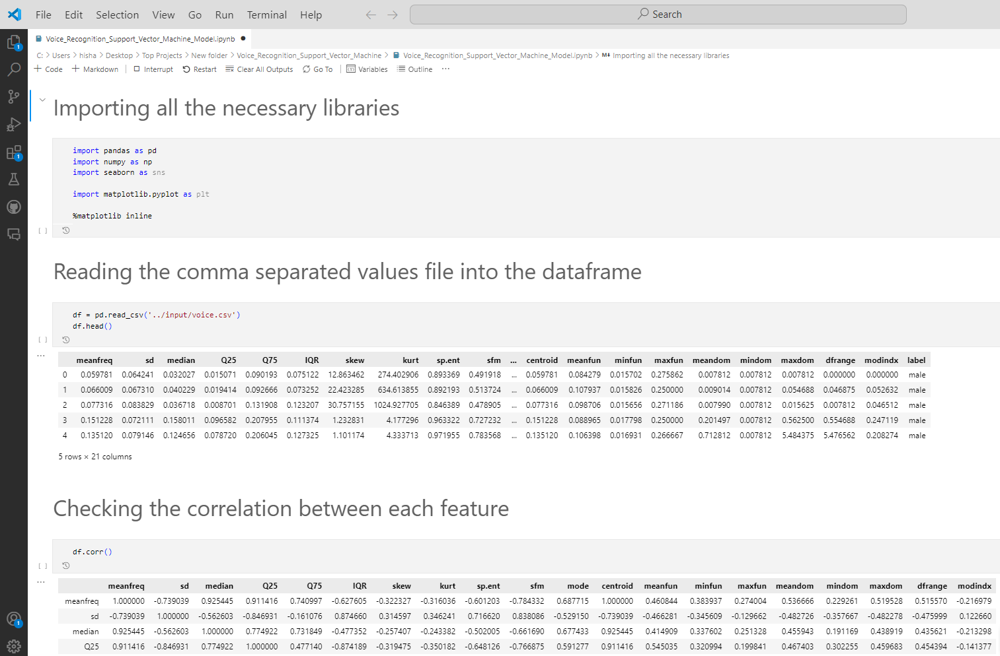
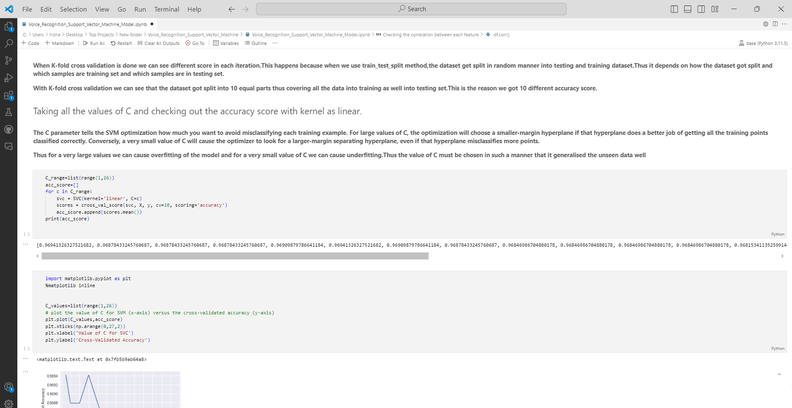
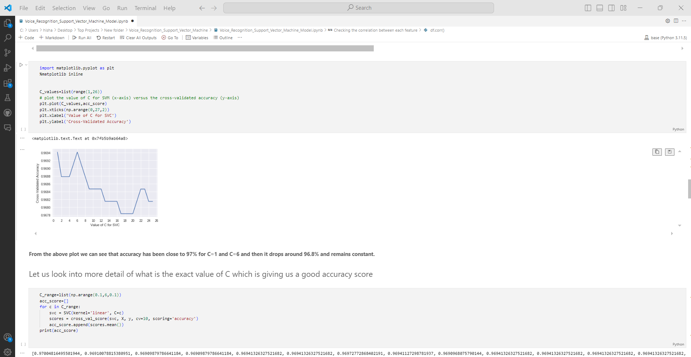
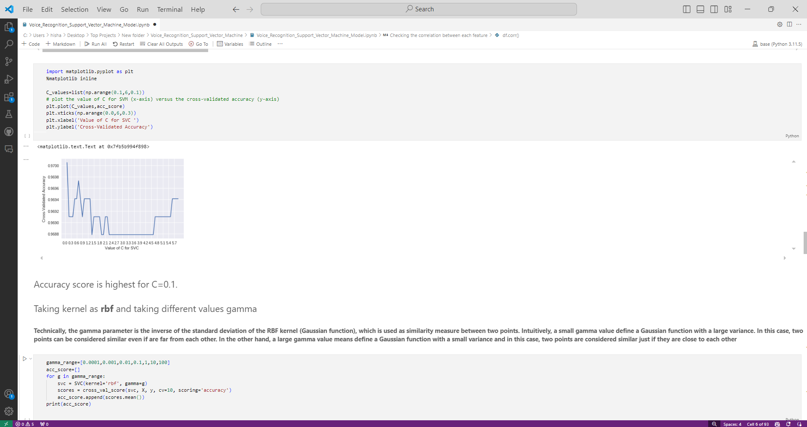

# Gender Classification Using Support Vector Machine (SVM)

This project demonstrates a machine learning approach to classify gender based on voice characteristics using Support Vector Machine (SVM) algorithms. It uses a dataset containing voice features extracted from male and female voice samples, and evaluates different SVM kernels and hyperparameters to find the optimal model for accurate classification.

## Table of Contents

1. [Introduction](#introduction)
2. [Dataset](#dataset)
3. [Libraries Used](#libraries-used)
4. [Data Preprocessing](#data-preprocessing)
5. [Model Training and Evaluation](#model-training-and-evaluation)
6. [Hyperparameter Tuning](#hyperparameter-tuning)
7. [Results](#results)
8. [Conclusion](#conclusion)

## Introduction

This project aims to classify male and female voices using their acoustic properties. We leverage the Support Vector Machine (SVM) method with different kernels and hyperparameter settings to achieve optimal classification performance. The primary focus is on understanding how different kernels (linear, RBF, and polynomial) and parameters like `C` and `gamma` affect model accuracy.

## Dataset

The dataset used in this project is the [Voice Gender Dataset](https://archive.ics.uci.edu/ml/datasets/gender+recognition+by+voice), which contains 3,168 samples with 21 acoustic features, such as mean frequency, median frequency, etc. Each sample is labeled as either 'male' or 'female'.

- **Total number of samples**: 3,168
- **Features**: 21
- **Classes**: 2 ('male' and 'female')

## Libraries Used

- `pandas`: Data manipulation and analysis.
- `numpy`: Numerical computing.
- `scikit-learn`: Machine learning algorithms and tools.
- `matplotlib`: Plotting and visualization.
- `seaborn`: Statistical data visualization.

## Data Preprocessing

1. **Data Loading**: The dataset is read into a Pandas DataFrame.
2. **Null Check**: Verified that there are no missing values in the dataset.
3. **Feature and Label Separation**: Extracted features and labels for further processing.
4. **Label Encoding**: Converted categorical labels ('male', 'female') into numerical values (1, 0) using `LabelEncoder`.
5. **Data Standardization**: Standardized features to have a mean of 0 and a standard deviation of 1 using `StandardScaler`.
6. **Data Splitting**: Split the dataset into training (80%) and testing (20%) sets.

## Model Training and Evaluation

- **Baseline Model**: SVM with default parameters was evaluated.
- **Kernels Used**: Linear, RBF (Radial Basis Function), Polynomial.
- **Performance Metrics**: Accuracy was used as the primary metric to evaluate model performance.

### Steps:

1. **Train-Test Split**: Data was divided into training and testing sets.
2. **SVM with Different Kernels**: SVM models with linear, RBF, and polynomial kernels were trained and evaluated.
3. **Cross-Validation**: 10-fold cross-validation was used to validate model performance across different data splits.

## Hyperparameter Tuning

**Grid Search** was used to find the best combination of parameters:

- **Linear Kernel**: Tuned the `C` parameter.
- **RBF Kernel**: Tuned the `gamma` and `C` parameters.
- **Polynomial Kernel**: Tuned the degree, `gamma`, and `C` parameters.

This approach helped identify the optimal hyperparameters for each kernel type to maximize classification accuracy.

## Results

- The best model achieved an accuracy of approximately 97% with a linear kernel and `C=0.1`.
- The RBF kernel performed best with `gamma=0.01`, also achieving similar accuracy.
- The polynomial kernel showed reduced performance at higher degrees, indicating overfitting.

## Conclusion

The SVM model demonstrated high accuracy in classifying gender based on voice features. Both linear and RBF kernels provided excellent performance with appropriate hyperparameter tuning. This project highlights the importance of choosing the right kernel and hyperparameters in SVM to achieve high classification accuracy.
## Screenshots

This README provides an overview of the SVM-based gender classification project, including data preprocessing, model evaluation, and hyperparameter tuning. For a detailed explanation and visualization, please refer to the project notebook.
